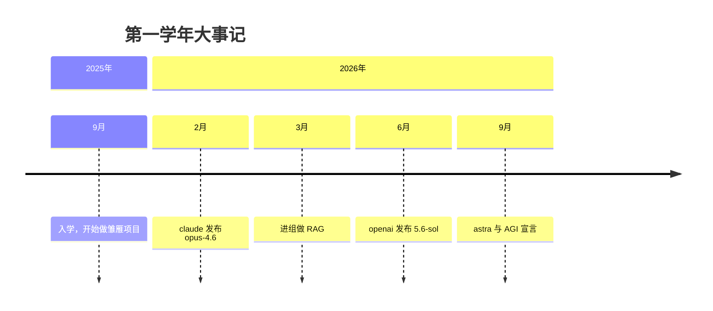

## 梦开始的地方

终于，一年结束了，推免出炉了，恰逢中秋佳节放个假，也该做一份总结了。
一年下来真实变化颇多，当然前言我是不会说那么多的，一些不适合以及细碎的琐事我也会一笔带过或者跳过，但首先我想做一个时间线。

### 时间线

### vibe coding 元年

渐行渐近的，愈演愈烈的，又轰轰烈烈的，就这样拉开了时代的序幕——名为“ vibe coding”，被称为氛围编码。提倡于根据感觉，通过自然语言的描述让大模型生成产品的代码。那时没有 agent，没有 harness, 没有agentic coding，更没有各种大模型冲榜。直到名为"人类"的 anthropic 发布了 claude，一个主攻于代码生成的大模型，彻底揭示了时代大势，一场浩浩荡荡的大炼丹行动就这么在全球范围内爆发。一个人要是不懂 gpt，不知道龙虾，那就是落了下乘，要被时代淘汰；如若是懂了很多，那就好像成了先驱者一般，是该受人景仰的，那打信息差赚的自然也是分享知识带领人类走进 AGI 时代的一点小辛苦费。

从新闻学到中转站，从文科生到深度学习，从医学到 3D 生成，做黄片的，做漫剧的，搞人机恋的...好似所有人都找到了自己的归宿，赚的盆满钵满。学生也有救了，有了一个 24 小时不间断的，知晓古今畅谈文理的老师。每个人正在这个时代大快朵颐、吃的满嘴流油。

我一个同学曾评价大模型的出现使世界进入了大嘉豪时代，不学什么就能知道搜索引擎不知道的事，文科生与7岁小孩也可以化身顶级开发者。那这么说确有其事，但好处是终于讨论理论不用再跟民科对线了。当然有利有弊的是总会有人拿一群 AI 生成的、伪造的、幻觉产生的东西大肆宣扬，这点无疑是令人厌烦的。好在寻现在大模型幻觉已经少之又少了，安全对齐做的到位，那些天天想在 AI 对话宣扬与论证自己的狂想之人终于不用拿着一群破铜烂铁到处炫耀了。

### 我们这一路走来真的太容易

之前我在我一篇博客中论证过，这整体属于绝对的上行期， AI 在创造无数岗位的同时并没有消灭所有的旧岗位——或许有缩招，但这些对于 AI 创造出的岗位以及价值来说简直是九牛一毛。也不仅仅如此，我说现在所有人属于风口上的飞猪，只要往中心拱一拱就能轻易达到以前人花了无数心力完成以及获得的。

当一个大一学生只要掌握了会使用 codex 就能拥有一个工程师数年的代码能力时，这一切显得太过容易，如果只是这样就足以开发出一个自己想要的功能，那么那些天天啃代码不断学习提升自己代码能力的人还会有多少呢？好处是显而易见的，而且是这么容易的获取。

当无数新大一问我该学点什么呢？我都推荐了先下载个 codex，我心里想着各种计网和操作系统的知识，agent 的各种机制和设计，但最后发现，我真能推荐的其实也就是一个方向而已，而又有多少人会走我的方向呢？大多都会中途离开的吧，如今确实是自学的时代，或许自由而又全面的发展就要实现了。

曾经，或者说大约 5 个月前，我还在忧虑 AI native 带来的破坏，当成果摆在面前时，你不得不承认，那群还在上初中高中的小孩就是做出了这样的产品，这值得自傲吗？或许吧，作为学了点算法知识的人，我发自内心的对于这种人有种“玩具”的看法，而对于那些深耕多年的，我只是一个入门者，vibe coding 带来的革新真切对我起到了极大的帮助，如果没有这样我或许还在慢慢学 springbot。

技术壁垒？说实话不多了，这个时代需要的是一群能折腾的人，我就卡在这不上不下的尴尬位置，学习我开了一个分区但几乎没发过（是学了一堆，但想起来写便又觉得索然无味），力扣也没天天刷点，基本是随心而动。所幸我还剩下点高中遗留下来的执行力，干了点活。

这一段我用了无数个“或许”、“也许”，人在静时总会陷入各种遐想。机会这么多如何掌握呢？自从我加入混元顶尖计划我见到了大多高学历高水平的人，胆子大的能折腾的可能就直接加微信了，但我胆子小啊，自信的人享受世界，当然我的自信不属于在这样的世界。

终于，ICLR 投稿量指数级上涨，各大 PR 层出不穷，所有人立即获得大结果，直接大满贯————

也许以后只有 AI 才能提升代码质量了吗？或许这是好事，人类总要从重复的工作中解放出来，投身于更具创造性的事物，但这一路上或许会一功将成万骨枯。

## 过去与将来

### 来年往事

又是一年秋，又想起了 fuzhengwen 在升旗台吟诗称尊，号称战人战题还战天。可惜这等人物终究因为没有竞赛被清华面拒，此诚无奈之事，最后去了上交自动化。从初中到高中，我还记得他连续拔得头筹后变成第六名，导致当年第五名的我得到了班主任红包。当然，当年中考我成为了全班第二，全市 27，距离满分就差十分，距离最高差四分，我还记得当年查成绩时别人望向我的眼神，充斥着震惊。昔日最可能第一第二的中考都没有考好。现在看来，中考也不过黄粱一梦，皆成灰罢了。

我还在初中，怕考不上一中，没有提前学高中知识，被那些早就学完的狠狠拉下。但我不会后悔，我可以说在不确定的结果中，我选择了最稳妥的一条路，这是个人选择罢了。也许以后我还会这么选择，也许不会，但谁有说得准呢？不确定的未来自然是希望所在。

刚上大学我还是有些许不甘的，按正常水平我可以上更好的地方，但现在也释怀了，北邮没有早晚自习、没有周考月考、不限电不调休，已经很好了

### 通向未来

今年我发现文学技艺消失了很多，这点不好，有的诗文都忘了，相当于一年没接触什么文学。以后找点诗词背背，看看正经文章增加素养。

这一年转换了无数方向，从后端到风控算法到全栈到 agent 开发到推理优化，现在来看数媒做游戏老本行了。之前感觉做游戏很麻烦，技术要求也高，后来我发现推理优化也挺难的，就回来看看游戏了，最近看了一下腾讯的青云计划 游戏+ AI 岗位，需求技术栈都没写清，我也不知道要这么干。慢慢来吧。

<b>
时针一直倒数着 
我们剩下的快乐 
此刻相拥的狂热 
却永远都深刻 
...</b>
<b>
有你便别无所求了——
</b>